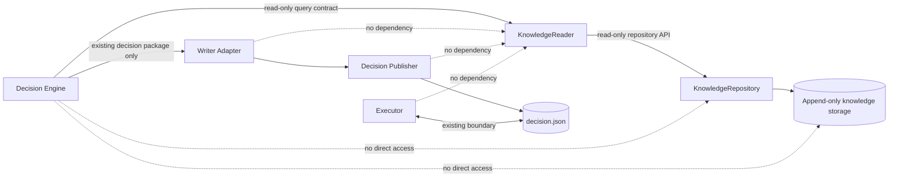
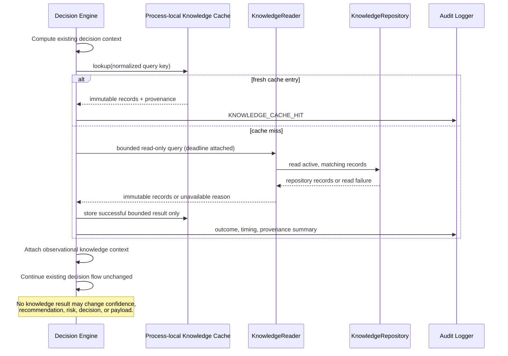

# PR-147 — Decision Engine Knowledge Integration Specification

**Status:** Design phase — contract only

**Baseline:** `44b69b9`

**Decision authority:** The existing Decision Engine remains authoritative.

**Implementation status:** No integration is introduced by this specification.

## 1. Purpose and non-goals

This document defines the future integration boundary through which the
Decision Engine may obtain verified Knowledge. It is a design contract; it
does not authorize a production import, a runtime path, a decision change, or
a change to confidence or recommendation logic.

The integration is **advisory observation only**. Knowledge can provide
versioned, attributable context to an already-computed decision cycle. It
cannot select direction, alter confidence, change thresholds, grant entry
permission, produce a recommendation, alter risk, or publish an execution
payload. Existing Decision Engine, Writer, Publisher, Executor, Broker Safety,
and MT5 ownership boundaries remain unchanged.

## 2. Dependency and integration boundaries

### 2.1 Allowed dependency direction



The sole permitted new production dependency is `Decision Engine ->
KnowledgeReader`. `KnowledgeReader` owns query validation and detachment;
`KnowledgeRepository` owns persistence access; storage remains an internal
repository detail. Neither the Writer Adapter, Decision Publisher, Executor,
Broker Safety, dashboard, nor MT5 may import, invoke, cache, or inspect
Knowledge.

The Decision Engine must depend on the reader's narrow interface, not a
concrete storage path, JSON format, repository type, writer, builder, validator,
or registry. `learning.knowledge.reader.KnowledgeReader` is the current
candidate boundary; a future injectable interface may replace its concrete type
only while preserving the contract in section 3.

### 2.2 Dependency diagram constraints

```text
Allowed:       Decision Engine -> KnowledgeReader -> KnowledgeRepository -> storage
Forbidden:     Decision Engine -> KnowledgeRepository | storage | writer | validator
Forbidden:     Writer/Publisher/Executor/MT5 -> KnowledgeReader | KnowledgeRepository | storage
Forbidden:     KnowledgeReader -> Decision Engine | Writer | Publisher | Executor | MT5
Forbidden:     Knowledge -> decision.json or any execution/risk payload field
```

Knowledge production remains one-way: discovery/validation/promotion create
verified append-only records; the reader exposes those records; consumption
never writes feedback into the same request path. Any future learning feedback
must be separately specified and asynchronous.

## 3. Read-only query contract

### 3.1 Required interface

The integration must issue exactly one bounded reader query per decision cycle
(zero is permitted when knowledge observation is disabled). The proposed
interface is expressed as a contract, not production code:

```text
query(symbol, session, market_state, status="ACTIVE")
    -> immutable ordered collection of VerifiedKnowledge records
    | unavailable result
```

`symbol`, `session`, and `market_state` are exact, normalized identifiers from
the already available decision context. `status` must be `"ACTIVE"` for
Decision Engine consumption. The interface must not expose a broad unfiltered
scan, arbitrary predicate, pagination loop, mutation method, or storage
location to the Decision Engine.

The reader result must be deterministic for the same repository state and
query, schema-valid, lineage-valid, and deeply immutable. Result ordering must
be stable and documented by the reader. The engine must cap the usable result
set at **20 records** after the reader returns it; overflow is an observable
`RESULT_LIMITED` condition, not a reason to retry or widen the query.

An unavailable result is represented at the adapter boundary as an empty,
immutable collection plus a reason code; it is never represented by an
exception entering decision logic. `None` remains valid only for a reader's
single-record lookup compatibility API, not for this integration query.

### 3.2 Read-only guarantees

For every query, the Decision Engine must:

* perform no write, promotion, validation, refresh, rebuild, compaction, or
  deletion operation;
* retain no reference that permits mutation of a returned record or its nested
  values;
* treat returned content as evidence metadata, not executable instructions;
* not infer missing facts, synthesize Knowledge, or query storage directly;
* not retry synchronously after an unavailable, invalid, timed-out, or
  over-budget result.

## 4. Decision-cycle sequence



## 5. Latency, timeout, and caching policy

The knowledge read is a best-effort side observation and must never delay a
decision cycle beyond its allocated budget.

| Control | Contract |
| --- | --- |
| End-to-end knowledge budget | **50 ms** maximum per decision cycle, including cache lookup, query, validation/detachment, and audit enqueue. |
| Reader deadline on cache miss | **35 ms** maximum, measured monotonically at the Decision Engine boundary. |
| Cache lookup budget | **5 ms** maximum. |
| Audit enqueue budget | **5 ms** maximum and non-blocking; an audit sink failure is ignored after local accounting. |
| Retry policy | No synchronous retry. The next independent decision cycle may attempt a new read. |
| Timeout outcome | Stop waiting at the deadline, discard partial results, emit `TIMEOUT`, and continue without knowledge. |

The cache is process-local, read-through, bounded to **256 query keys**, and
stores only successful, immutable, capped results with provenance. Its key is
the normalized tuple `(symbol, session, market_state, status, reader_contract_version)`.
The fresh TTL is **30 seconds**. An expired entry must not be used as a
decision input; it may be retained only for diagnostic comparison and must be
labelled `STALE_DIAGNOSTIC_ONLY`. Cache eviction is deterministic LRU. The cache
must be cleared on process restart and on an explicit reader-contract-version
change. It must never persist to disk or share state with the Knowledge
Repository.

## 6. Confidence handoff and auditability

Knowledge handoff is metadata-only. The integration adapter may construct an
immutable `KnowledgeObservation` containing the query key, record identifiers,
record versions, schema versions, source lineage/version, result count, cache
state, latency, and outcome reason. It must not include a derived score,
weight, confidence adjustment, recommendation, decision override, risk value,
or executable instruction.

The existing confidence value remains created and owned by the existing
Decision Engine path. It is neither read as an input to KnowledgeReader nor
modified from a Knowledge observation. Any future confidence-calibration or
recommendation proposal requires a separately approved architecture version,
its own data contract, deterministic evaluation plan, safety review, and
explicit implementation task.

For every attempted read, enqueue one structured audit event with: event time,
decision-cycle correlation ID, normalized query key, outcome code, cache state,
elapsed milliseconds, result count, capped/overflow indicator, and (for
successful results) record UUID/version plus repository/lineage provenance.
Audit records must omit raw market snapshots, account identifiers, credentials,
and mutable Knowledge content. Audit logging is append-only and observational;
it may not call the Decision Engine, delay publication, or cause a retry.

## 7. Failure matrix

| Condition | Reader/adapter action | Decision Engine action | Cache action | Audit outcome |
| --- | --- | --- | --- | --- |
| Fresh cache hit | Return immutable cached observation. | Continue existing flow. | Keep entry. | `KNOWLEDGE_CACHE_HIT` |
| Cache miss, valid bounded result | Return immutable ordered observation. | Continue existing flow unchanged. | Store fresh result. | `KNOWLEDGE_QUERY_OK` |
| No matching active knowledge | Return empty available observation. | Continue existing flow unchanged. | Cache empty result for fresh TTL. | `KNOWLEDGE_EMPTY` |
| Repository/read I/O error | Convert to unavailable reason; do not leak exception. | Continue without knowledge; no retry. | Do not populate/overwrite fresh entry. | `KNOWLEDGE_UNAVAILABLE_IO` |
| Invalid schema, invalid lineage, malformed record | Exclude invalid data; if no valid result remains, return unavailable/empty according to reader validation outcome. | Continue without untrusted data. | Do not cache an unavailable result. | `KNOWLEDGE_INVALID_RECORD` |
| Deadline exceeded | Cancel/abandon read; discard partial data. | Continue without knowledge; no retry. | Do not cache result. | `KNOWLEDGE_TIMEOUT` |
| Result exceeds 20 records | Preserve stable first 20 only; mark capped. | Continue existing flow unchanged. | Cache capped result and indicator. | `KNOWLEDGE_RESULT_LIMITED` |
| Cache corruption or immutable-contract violation | Discard cache entry; treat as unavailable. | Continue without knowledge. | Evict affected entry. | `KNOWLEDGE_CACHE_INVALID` |
| Audit sink failure | Do not propagate failure. | Continue existing flow unchanged. | No change. | Local counter only: `KNOWLEDGE_AUDIT_DROPPED` |

No failure in this matrix may produce `WAIT`, `TRADE`, a confidence change, a
recommendation change, a risk change, a payload mutation, or an executor
instruction. Existing independent failures retain their current behavior.

## 8. Architecture constraints and acceptance criteria

1. This PR is documentation-only. It must add no production source change, no
   import change, no runtime configuration change, and no behavior test that
   asserts new runtime behavior.
2. Any implementation must preserve the existing no-touch Decision Engine and
   execution authority boundaries until separately approved.
3. Static architecture checks must reject direct Decision Engine access to
   `KnowledgeRepository`, storage/path/JSON APIs, or any Learning write API.
4. Static architecture checks must reject Learning imports from Writer,
   Publisher, Executor, Broker Safety, dashboard, and MT5-facing components.
5. Knowledge records crossing the boundary must be deeply immutable,
   schema-valid, lineage-valid, and provenance-bearing; invalid records must
   fail closed as unavailable evidence.
6. The integration must be dependency-injected and testable with a fake reader;
   tests must prove timeout, empty result, invalid result, cache hit/miss,
   eviction, and every failure-matrix continuation behavior.
7. The total budget and no-synchronous-retry rule are hard requirements. A
   cache, reader, or audit implementation must not create a new blocking
   decision dependency.
8. Knowledge must not be serialized into `decision.json` or any execution
   payload. Only separately governed audit telemetry may identify observed
   record provenance.

## 9. Migration plan

| Phase | Change scope | Exit criteria | Rollback |
| --- | --- | --- | --- |
| 0 — Design approval | This specification only. | Architecture review accepts all sections and confirms no runtime change. | Revert documentation commit. |
| 1 — Contract tests | Add isolated interface/static-architecture tests and fake-reader fixtures; no production wiring. | Tests prove permitted/forbidden dependencies and failure semantics. | Remove test-only additions. |
| 2 — Reader hardening | Verify reader immutability, deterministic ordering, unavailable mapping, and bounded query behavior in Learning-owned tests. | Reader contract tests and performance tests meet section 5. | Disable candidate release; no Decision Engine dependency exists yet. |
| 3 — Dark observation | Separately approved injection into the Decision Engine, with observations sent only to audit telemetry and no payload or decision use. | Soak evidence demonstrates budgets, audit completeness, and zero decision/payload deltas. | Feature flag disables injection; clear process-local cache. |
| 4 — Governance review | Review dark-observation evidence, security, latency, and boundary tests. | Written approval for any next use is issued. | Keep dark observation disabled. |
| 5 — Future semantic proposal | Separate PR for any confidence or recommendation use, if ever approved. | New contract explicitly changes the non-goals in this document. | Retain observation-only behavior. |

Phases 1 through 5 are future work and are not authorized by this PR. Phase 3
is explicitly observational: it does not implement confidence logic,
recommendation logic, or a runtime behavior change.
